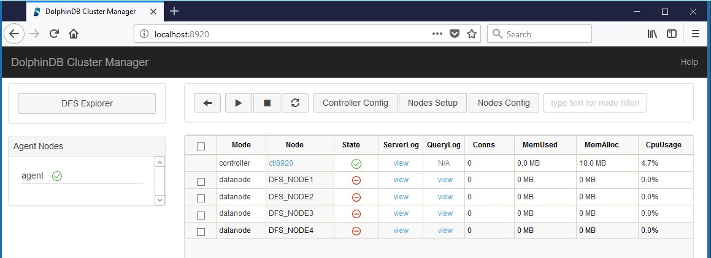
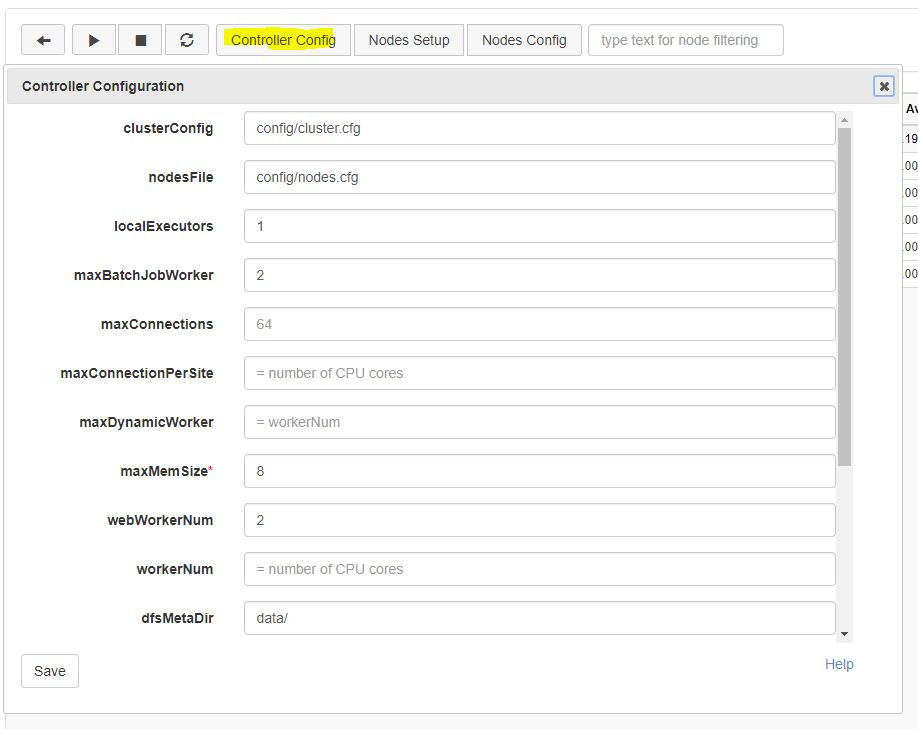
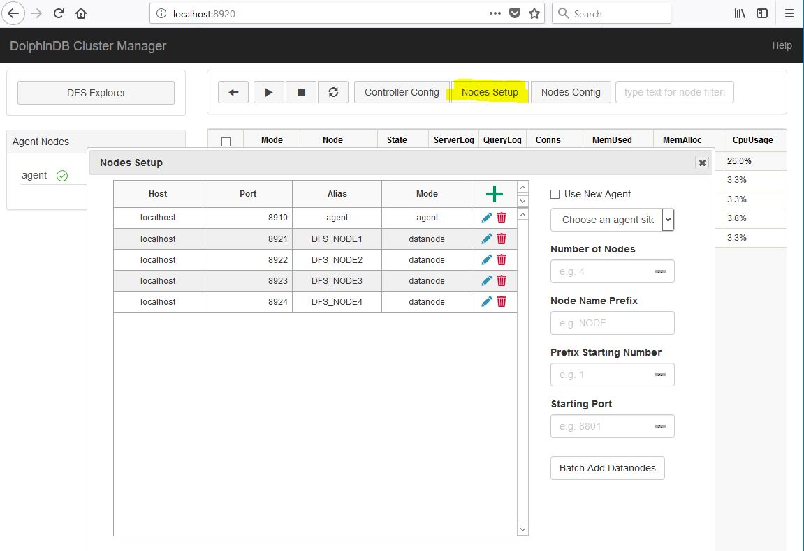

### DolphinDB 单物理节点集群部署

DolphinDB Cluster包括三种类型节点：datanode节点，agent节点和controller节点。
  *  datanode节点用于数据存储，查询以及计算
  *  agent节点用于关闭开启datanode节点
  *  controller节点用于集群管理

#### 1. 下载DolphinDB，并解压到一个指定目录
例如解压到如下目录

```
/DolphinDB
```

#### 2. 软件授权许可更新

如果用户拿到了企业版试用授权许可，只需要把如下文件替换成新的授权许可即可

##### 2.1. 企业版与社区版的区别

与社区版本相比，企业版支持更多的节点，CPU内核和内存。

```
/DolphinDB/server/dolphindb.lic
```

#### 3. DolphinDB 集群初始配置和启动

在配置集群的时候请核对授权文件规定的节点个数，每个节点最多内核和最大内存限制。如果配置超出授权文件规定，集群或节点将无法正常启动。这些异常信息都会在log文件中标注。

##### 3.1. 进入server目录
```
cd /DolphinDB/server/
```

##### 3.2. 在server目录下，创建config, data, log 子目录
```
mkdir /DolphinDB/server/config  //store config files
mkdir /DolphinDB/server/data  //store data
mkdir /DolphinDB/server/log //store log files
```

##### 3.3. 在config目录下，创建controller.cfg文件，并填写如下内容。用户可根据实际情况，调整参数

这些选项可以在启动dolphindb server的命令行中通过 “-参数名 参数值”来设置，但是当需要设置的参数很多时，建议在config文件中设置。
```
localSite=localhost:8920:ctl8920     //节点局域网信息,格式为 IP地址:端口号:节点别名，所有字段都是必选项。
localExecutors=3                   //本地执行者的数量。默认值是CPU的内核数量 - 1。
maxConnections=128                 //最大向内连接数。
maxMemSize=16                      //最大内存数量。
webWorkerNum=4                     //处理http请求的工作池的大小。默认值是1。
workerNum=4                        //常规交互式作业的工作池大小。默认值是CPU的内核数量。
dfsReplicationFactor=1             //每个表分区或文件块的副本数量。默认值是2。
dfsReplicaReliabilityLevel=0       //多个副本是否可以驻留在同一台物理服务器上。 0：是; 1：不。默认值是0。
```

##### 3.4. 在config目录下，创建agent.cfg文件，并填写如下内容。用户可根据实际情况，调整参数

DolphinDB Agent的用途是启动关闭节点。  本教程agent.cfg里面定义了agent的常用参数。
```
workerNum=3
localExecutors=2
maxMemSize=4
localSite=localhost:8910:agent
controllerSite=localhost:8920:ctl8920
```

##### 3.5. 在config目录下，创建cluster.nodes文件，并填写如下内容。用户可根据实际情况，调整参数
cluster.nodes用于存放集群数据/计算节点信息。本教程使用4个节点，用户可根据授权证书更改节点个数。该配置文件分为两列，第一例存放节点IP地址，端口号，和节点别名。这三个信息由冒号“：”分隔。第二列是说明节点类型。比如agent节点，类型为agent,
而数据节点类型为datanode. 这里是大小写敏感的。

```
localSite,mode
localhost:8910:agent,agent
localhost:8921:DFS_NODE1,datanode
localhost:8922:DFS_NODE2,datanode
localhost:8923:DFS_NODE3,datanode
localhost:8924:DFS_NODE4,datanode
```

##### 3.6. 在config目录下，创建cluster.cfg文件，并填写如下内容。用户可根据实际情况，调整参数
cluster.cfg用于存放集群数据/计算节点需要的参数。例如下面定义的参数说明集群上每个节点都使用相同的配置
```
maxConnections=128
maxMemSize=32
workerNum=8
localExecutors=7
webWorkerNum=2
```

##### 3.7. 启动 agent

在server目录即可执行文件所在目录运行以下命令行。注意到agent.log存放在log子目录下，如果出现agent无法正常启动的情况，可以根据此log file来诊断错误原因。

##### L建议通过linux命令**nohup**（头） 和 **&**（尾） 启动为后台运行模式，这样即使断开程序，也会照常运行。 console默认是开启的，如果要设置为后台运行，必须要设置为0，否者nohup的log文件会占用很大磁盘空间。“-mode”表示节点启动为agent模式，“-home”指定数据以及元数据存储路径，“-config”指定配置文件路径，“-logFile”指定log文件路径。

###### 启动为后台模式
```
nohup ./dolphindb -console 0 -mode agent -home data -config config/agent.cfg -logFile log/agent.log &
```

###### 启动为前端交互模式

```
./dolphindb -mode agent -home data -config config/agent.cfg -logFile log/agent.log
```

##### Windows
```
dolphindb.exe -mode agent -home data -config config/agent.cfg -logFile log/agent.log
```

##### 3.8. 启动 controller

在server目录即可执行文件所在目录运行以下命令行。注意到controller.log存放在log子目录下，如果出现agent无法正常启动的情况，可以根据此log file来诊断错误原因。

##### Linux

###### 启动为后台模式
```
nohup ./dolphindb -console 0 -mode controller -home data -config config/controller.cfg -clusterConfig config/cluster.cfg -logFile log/controller.log -nodesFile config/cluster.nodes &
```

###### 启动为前端交互模式
```
./dolphindb -mode controller -home data -config config/controller.cfg -clusterConfig config/cluster.cfg -logFile log/controller.log -nodesFile config/cluster.nodes
```

##### Windows
```
dolphindb.exe -mode controller -home data -config config/controller.cfg -clusterConfig config/cluster.cfg -logFile log/controller.log -nodesFile config/cluster.nodes
```

##### 3.9. 如何关闭agent和controller节点

如果是启动为前端交互模式，可以在控制台中输入"quit"退出

```
quit
```

如果是启动为后台交互模式，需要用linux系统kill命令。假设运行命令的linux系统用户名为 "ec2-user"
```
ps aux | grep dolphindb  | grep -v grep | grep ec2-user|  awk '{print $2}' | xargs kill -TERM
```

##### 3.10. 启动和关闭datanode节点
在controller和agent节点都启动的前提下，数据节点的开启和关闭可以通过DolphinDB提供的集群和管理界面。下一节有详细介绍。

##### 3.11. 进入集群Web管理界面

```
到浏览器中输入(目前支持浏览器为chrome, firefox)： localhost:8920 (8920为controller的端口号)
```


#### 3.12. 启动数据节点

全选所有数据节点之后，点击执行图标，并确定。然后，点击刷新图标来查看状态。有的时候，尤其刚关闭完节点，重新启动之后，需要多执行几次才能启动。主要原因是操作系统没有释放资源。
如果出现长时间无法正常启动，请查看log目录下该即诶但的logFile. 如果节点名字是DFS_NODE1，那对应的logFile应该在 log/DFS_NODE1.log。
常见节点无法正常启动原因包括:1)超出授权证书规定节点数、内存大小、以及核的数目。如果出现这种情况，logFile中会有明确说明；2)数据文件破坏。这种情况要依据logFile出错信息，具体情况具体分析。


#### 3.13. DolphinDB集群已经部署成功
成功启动后，State列会用绿色对号显示成功启动。


#### 4. DolphinDB 集群配置和管理
经过上述步骤，我们已经成功部署DolphinDB Cluster. 在实际使用中我们经常会遇到需要更改参数配置，增加数据节点等等。DolphinDB的网络界面提供配置DolphinDB集群的所有功能。
#### 4.1. controller配置

点击按钮 Controller Config


#### 4.2. 数据节点配置

点击按钮 Nodes Setup, 进行添加删除数据节点。注意如果节点上已经存放数据，删除节点有可能会造成数据丢失



点击按钮 Nodes Config, 进行数据节点配置


#### 5. DolphinDB 集群详细配置以及参数意义

中文

http://dolphindb.com/cn/help/Newtopic47.html

英文

http://dolphindb.com/help/ClusterSetup.html
