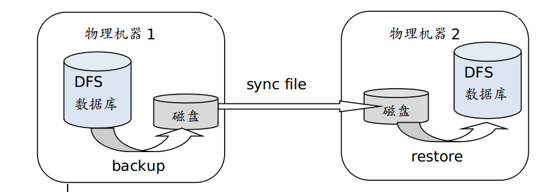

# DolphinDB 集群间数据库同步

DolphinDB提供离线方式和在线方式实现不同集群间数据库的同步。 
* 离线方式：通过数据库备份和恢复功能实现数据同步。
* 在线方式：通过建立在线连接，把数据从一个库读取再写入到另一个库中。
数据库指的是DFS分布式的数据库，而非内存表或流数据表等。

## 1. 离线方式
离线方式先把数据库中数据，通过DolphinDB内置的`backup`函数以二进制形式导入到磁盘，然后将数据同步到数据库所在的物理机器上，再通过`restore`函数将数据从磁盘恢复到到数据库。如下所示：  

   

### 1.1 数据备份
通过backup函数将需要同步的数据表备份到磁盘上，备份以分区为单位。需要同步的数据可以用sql语句指定，如下：  
示例1，备份数据库db1中表mt的所有数据。
```
backupDir = /hdd/hdd1/backDir		
backup(backupDir,<select * from loadTable("dfs://db1","mt")>)
```

示例2，备份数据库db1中表mt的最近7天的数据，假设时间分区字段是TradingDay(DATE)。
```
backupDir = /hdd/hdd1/backDir		
backup(backupDir,<select * from loadTable("dfs://db1","mt") where TradingDay > date(now()) - 7 and  TradingDay <= date(now())>)
```

示例3，备份数据库db1中表mt的某些列(col1,col2,col3)的数据：
```
backupDir = /hdd/hdd1/backDir		
backup(backupDir,<select col1,col2,col3 from loadTable("dfs://db1","mt")>)
```
更灵活的sql元语句表示参考DolphinDB元编程教程。

### 1.2 节点间数据文件同步
如果需要同步的两个数据库不在同一台物理机器上，则需要同步二进制文件。DolphinDB支持shell命令，可利用操作系统提供的文件同步手段来同步目录，例如rsync或者scp命令。其中rsync是linux上的常用命令，只同步发生变化的文件，非常高效。
```
cmd = "rsync -av  " + backupDir + "/*  " + userName + "@" + restoreIP + ":" + restoreDir 
shell(cmd)
```
以上脚本，将一台机器上backupDir目录下的所有发生变化的文件同步到另一台机器的restoreDir目录下。其中，userName和restoreIP是通过ssh登录的用户名以及远程机器的IP地址。
> 注意:以上命令需要配置ssh免密登录。当然，也可以通过其他服务器同步工具实现。

### 1.3 数据恢复
数据同步以后，可通过DolphinDB内置的`restore`函数，从restoreDir中恢复出所需要的数据。

示例1，恢复所有备份数据库db1表mt的所有数据到数据库db2的表mt中。
```
restore(restoreDir,"dfs://db1","mt","%",true,loadTable("dfs://db2","mt"))
```
除了恢复所有数据，还可以根据条件恢复指定分区。详细参考教程[数据备份与恢复](restore-backup.md)。

### 1.4 具体实例
两个DolphinDB集群部署在不同的机器上。需要每天22:30，同步A集群上的数据库(db1，包括表mt)的所有数据到B集群上。数据库db1的分区类型为VALUE，按天分区，分区字段为Timestamp(类型为TIMESTAMP)。    

```
//脚本应在B集群上，也就是需要恢复数据的集群上执行。
def syncDataBases(backupNodeIP,backupNodePort,backupDir,restoreServerIP, userName,restoreDir){
	conn = xdb(backupNodeIP,backupNodePort)
	conn(login{`admin,`123456})
	conn(backup{backupDir,<select * from loadTable("dfs://db1","mt") where Timestamp > timestamp(date(now())) and Timestamp < now()>})
	cmd = "rsync -av  " + backupDir + "/*  " + userName + "@" + restoreServerIP + ":" + restoreDir 
	conn(shell{cmd})
	restore(restoreDir,"dfs://db1","mt","%",true,loadTable("dfs://db1","mt"))
}

login(`admin,`123456)
//配置备份节点的IP address，端口，以及备份机器上的物理目录，该目录应是空目录。
backupNodeIP = '115.239.209.234' 
backupNodePort = 18846
backupDir = "/home/pfsui/myselfTest/backupDir"
//配置恢复数据节点的IP address，由备份机器到恢复机器的ssh登录用户名（机器间应配置好ssh免密登录），以及恢复节点上的物理空目录。
restoreServerIP = '115.239.209.234'
userName = 'user1'
restoreDir = "/home/pfsui/myselfTest/backupDir"

//手动触发备份
syncDataBases(backupNodeIP,backupNodePort,backupDir,restoreServerIP, userName,restoreDir)
//通过scheduleJob方式，每天22:30定时执行
scheduleJob("syncDB","syncDB",syncDataBases{backupNodeIP,backupNodePort,backupDir,restoreServerIP, userName,restoreDir},22:30m,2019.01.01,2030.12.31,'D')
```
先通过`backup`函数备份数据数据到系统磁盘，然后使用shell命令rsync来同步不同物理机器上的目录，最后使用`restore`函数恢复数据到数据库。可使用`scheduleJob`函数来启动定时任务。

## 2 在线方式

### 2.1 数据在线同步

在线方式，要求两个集群同时在线，通过建立socket连接，直接从一个集群中读数据，并写入到另一个集群上。如下图所示:

 


### 2.1 具体示例
场景跟上面场景一致，我们考虑两种场景，一是内存足够容纳一天的数据，二是内存不足以容纳一天的数据。

场景1，内存足够容纳一天数据，具体代码如下：
```
def writeData(dbName,tableName,t) : loadTable(dbName,tableName).append!(t)
def synDataBaseOnline(restoreServerIP,restoreServerPort){
	t = select * from loadTable("dfs://db1","mt") where Timestamp > timestamp(date(now())) and Timestamp < now()
	conn = xdb(restoreServerIP,restoreServerPort)
	conn(login{`admin,`123456})
	conn(writeData{"dfs://db1","mt",t})
}
login(`admin,`123456)
restoreServerIP = '115.239.209.234'
restoreServerPort = 18848
synDataBaseOnline(restoreServerIP,restoreServerPort)
```
脚本在备份节点执行，从数据库中取出当前的数据，并远程写入到恢复节点的数据库中。

场景2，当天数据量太大，内存不足以容纳：
```
def writeData(dbName,tableName,t) : loadTable(dbName,tableName).append!(t)
def writeRemoteDB(t, ip, port, dbName,tableName){
	conn = xdb(ip, port)
	conn(login{`admin,`123456})
	remoteRun(conn,writeData,dbName,tableName,t)
}
def synDataBaseOnline(ip, port){
	ts = <select * from loadTable("dfs://db1","mt") where Timestamp > timestamp(date(now())) and Timestamp < now()>
	ds = repartitionDS(ts,`sym,RANGE,10)
	mr(ds, writeRemoteDB{,ip,port,"dfs://db1","mt"},,, false)
}
login(`admin,`123456)
restoreServerIP = '115.239.209.234'
restoreServerPort = 18848

//手动触发
synDataBaseOnline(restoreServerIP,restoreServerPort)

//定时触发
scheduleJob("syncDB","syncDB",synDataBaseOnline{restoreServerIP,restoreServerPort},22:30m,2019.01.01,2030.12.31,'D')
```
如果当天的数据量太大，可以通过`repartitionDS`函数将数据再分区。本例把当天数据按照sym字段再进行切分为10份，最后通过`mr`函数将这10份数据逐一写到远程，`mr`函数的parallel参数设为false，不采用并行执行，以尽量少占用内存。如果内存充足，并行的效率更高。

## 3 两种方式对比
__性能__：在线方式中，数据不用存盘，直接通过网络传输到远端并写入数据库；而离线方式先把数据备份到磁盘上，再通过网络传输到远端的磁盘上，再读取磁盘数据并写入数据库，因此性能低于在线方式。  
__内存要求__：离线方式是以分区为单位备份的，因此要求内存必须容纳一个分区的完整数据。一般情况下，没有什么问题。但在某些特殊场景下，比如表的列特别多（几千列），而平时常用的字段很少（10几个），设计每个分区容量的时候，可能更多的考虑常用字段，而不是表的全部字段。这种情况下，内存有可能不能容纳一个分区所有列的数据。而在线方式对内存容量的要求要低很多，若分区数据量超过内存，可对一个分区再进行更细粒度的划分。  
__磁盘占用__：离线方式在本机以及远端都需要存盘，占用更多的磁盘空间，在线方式不需要额外占用磁盘空间。  
__其他方面__：离线方式不需要两个集群同时在线，数据备份后，可以在不同的时间段进行数据同步。在线方式需要两个集群都同时在线，都能正常提供服务。 
