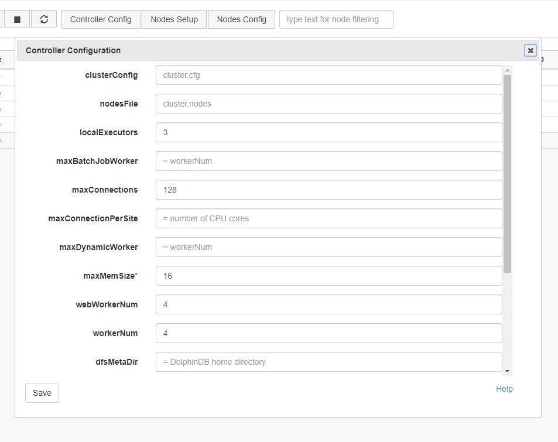
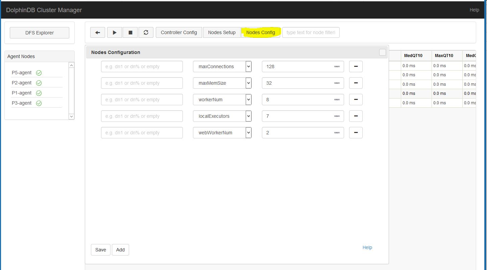

# DolphinDB 多物理节点集群部署

DolphinDB Cluster包括三种类型节点：数据节点（data node），代理节点（agent）和控制节点（controller）。
  *  data node用于数据存储，查询以及计算
  *  agent用于关闭开启data node
  *  controller用于集群管理以及管理分布式文件系统的元素据。

本教程假设有五个物理节点: P1,P2,P3,P4,P5。
这五个物理节点的对应的内网地址为
```
P1: 10.1.1.1
P2: 10.1.1.3
P3: 10.1.1.5
P4: 10.1.1.7
P5: 10.1.1.9
```

我们将控制节点设置在P4节点上，在其它每个节点上设置一个代理节点和一个数据节点。这里需要说明一下，每个物理节点必须要有一个代理节点，用于启动和关闭该物理节点上的一个或多个数据节点。DolphinDB每个集群有且仅有一个活动的控制节点。

#### 1. 下载

在每个物理节点上，从DolphindB网站下载DolphinDB，并解压到一个指定目录。例如解压到如下目录

```
/DolphinDB
```

#### 2. 软件授权许可更新

如果用户拿到了企业版试用授权许可，只需要把如下文件替换成新的授权许可即可。每个物理节点的license文件都需要更新。与社区版本相比，企业版支持更多的节点，CPU内核和内存。

```
/DolphinDB/server/dolphindb.lic
```

#### 3. DolphinDB 集群初始配置

启动一个集群，必须配置控制节点和代理节点。数据节点可以在集群启动后通过web界面来配置，当然也可以在初始阶段手工配置。

#### 3.1 配置控制节点

在配置集群的时候请核对授权文件规定的节点个数，每个节点最多内核和最大内存限制。如果配置超出授权文件规定，集群或节点将无法正常启动。这些异常信息都会记录在log文件中。

登录P4服务器，进入server子目录。在server目录下，以Linux为例，创建config, data, log 子目录。 DolphinDB缺省情况下会将server所在目录作为home目录，所有的配置文件和log文件也都会放在home目录下面。为了便于管理，本教程创建了如下目录来分别存放这些内容，但是这不是必须的。

```
cd /DolphinDB/server/

mkdir /DolphinDB/server/config
mkdir /DolphinDB/server/data
mkdir /DolphinDB/server/log
```
##### 3.1.1 配置控制节点的参数文件
在config目录下，创建controller.cfg文件，并填写如下内容。用户可根据实际情况，调整参数。 本教程在controller.cfg里定义了集群管理的常用参数。这些参数中，localSite必须定义，其它都是可选的。

```
localSite=10.1.1.7:8900:master
localExecutors=3
maxConnections=128
maxMemSize=16
webWorkerNum=4
workerNum=4
dfsReplicationFactor=1
dfsReplicaReliabilityLevel=0
```

以下是对这些参数的解释

| 参数配置        | 解释          |
|:------------- |:-------------|
|localSite=10.1.1.7::master|     节点局域网信息,格式为 IP地址:端口号:节点别名，所有字段都是必选项。|
|localExecutors=3          |         本地执行者的数量。默认值是CPU的内核数量 - 1。|
|maxConnections=128     |            最大向内连接数。|
|maxMemSize=16          |            最大内存数量。|
|webWorkerNum=4              |       处理http请求的工作池的大小。默认值是1。|
|workerNum=4        |                常规交互式作业的工作池大小。默认值是CPU的内核数量。|
|dfsReplicationFactor=1         |    每个表分区或文件块的副本数量。默认值是2。|
|dfsReplicaReliabilityLevel=0     |  多个副本是否可以驻留在同一台物理服务器上。 0：是; 1：不。默认值是0。|

##### 3.1.2 配置集群成员参数文件

cluster.nodes用于存放集群代理节点和数据节点信息。本教程使用5个物理节点，用户可根据授权证书更改节点个数。该配置文件分为两列，第一例存放节点IP地址，端口号和节点别名。这三个信息由冒号“:”分隔。第二列是说明节点类型。比如agent节点，类型为agent,而数据节点类型为datanode。节点别名是大小写敏感的，而且在集群内必须是唯一的。

在这里，我们把controller节点设置在**P4**，节点配置信息需要包含**P1,P2,P3,P5**的agent和data node信息。

```
localSite,mode
10.1.1.1:8960:P1-agent,agent
10.1.1.1:8961:P1-NODE1,datanode
10.1.1.3:8960,P2-agent,agent
10.1.1.3:8961:P2-NODE1,datanode
10.1.1.5:8960:P3-agent,agent
10.1.1.5:8961:P3-NODE1,datanode
10.1.1.9:8960:P5-agent,agent
10.1.1.9:8961:P5-NODE1,datanode
```

#### 3.1.3 配置数据节点的参数文件

在config目录下，创建cluster.cfg文件，并填写如下内容。用户可根据实际情况，调整参数。cluster.cfg用于存放集群数据和计算节点的配置参数。例如下面定义的参数说明集群上每个节点都使用相同的配置

```
maxConnections=128
maxMemSize=32
workerNum=8
localExecutors=7
webWorkerNum=2
```


#### 3.2 配置代理节点

P1,P2,P3,P5为代理节点。进入每个服务器，在server目录下，创建config, data, log子目录。DolphinDB缺省情况下会将server所在目录作为home目录，所有的配置文件和log文件也都会放在home目录下面。为了便于管理，本教程创建了如下目录来分别存放这些内容，但是这不是必须的。

```
cd /DolphinDB/server/
mkdir /DolphinDB/server/config
mkdir /DolphinDB/server/data
mkdir /DolphinDB/server/log
```

在config目录下，创建agent.cfg文件，并填写如下内容。用户可根据实际情况，调整参数。 下面列出P1,P2,P3,P5每台服务器上的agent.cfg内容。请注意，节点别名在集群内部必须是唯一的。如果两个节点采用同一个别名，将会造成节点无法响应请求。

这里需要注意的是，由于集群中controller是唯一的, agent与controller建立联系的通道是根据controllerSite这个参数指定的地址，而controller的地址是通过在controller.cfg的localSite参数来指定的，所以controller在controller.cfg里面的localSite要和所有agent里面的controllerSite的配置完全相同。如果controller的localSite更改了(即使只是别名更改），所有agent里的controllerSite配置也必须做出相应更改。在本教程中，controller.cfg的localSite是 **10.1.1.7:8990:master**, 所有agent的 controllerSite的参数配置也是**10.1.1.7:8990:master**.

#### P1
```
workerNum=3
localExecutors=2
maxMemSize=4
localSite=10.1.1.1:8960:P1-agent
controllerSite=10.1.1.7:8990:master
```

#### P2
```
workerNum=3
localExecutors=2
maxMemSize=4
localSite=10.1.1.3:8960:P2-agent
controllerSite=10.1.1.7:8990:master
```

#### P3
```
workerNum=3
localExecutors=2
maxMemSize=4
localSite=10.1.1.5:8960:P3-agent
controllerSite=10.1.1.7:8990:master
```

#### P5
```
workerNum=3
localExecutors=2
maxMemSize=4
localSite=10.1.1.9:8960:P5-agent
controllerSite=10.1.1.7:8990:master
```


#### 3.3 DolphinDB集群启动

#### 3.3.1 启动代理节点

进入P1,P2,P3,P5每台服务器，在server目录，即可执行文件所在目录运行以下命令行。agent.log文件存放在log子目录下，如果出现agent无法正常启动的情况，可以根据此日志文件来诊断错误原因。

#### Linux

建议通过linux命令**nohup**（头） 和 **&**（尾） 启动为后台运行模式，这样即使断开程序，也会照常运行。 console默认是开启的，如果要设置为后台运行，必须要设置为0，否者nohup的log文件会占用很大磁盘空间。“-mode”表示节点启动为agent模式，“-home”指定数据以及元数据存储路径，“-config”指定配置文件路径，“-logFile”指定log文件路径。

#### 启动为后台模式
```
nohup ./dolphindb -console 0 -mode agent -home data -config config/agent.cfg -logFile log/agent.log &
```

#### 启动为前端交互模式

```
./dolphindb -mode agent -home data -config config/agent.cfg -logFile log/agent.log
```

#### Windows
```
dolphindb.exe -mode agent -home data -config config/agent.cfg -logFile log/agent.log
```

#### 3.3.2 启动控制节点

进入P4服务器，在server目录，即可执行文件所在目录运行以下命令行。注意controller.log文件存放在log子目录下，如果出现controller无法正常启动的情况，可以根据此日志文件来诊断错误原因。
“-clusterConfig”用于指定集群节点配置文件路径，“-nodesFile”用于指定集群节点成员，以及它们的节点类型、IP地址、端口号、别名信息。

#### Linux
```
nohup ./dolphindb -console 0 -mode controller -home data -config config/controller.cfg -clusterConfig config/cluster.cfg -logFile log/controller.log -nodesFile config/cluster.nodes &
```

#### Windows
```
dolphindb.exe -mode controller -home data -config config/controller.cfg -clusterConfig config/cluster.cfg -logFile log/controller.log -nodesFile config/cluster.nodes
```

#### 3.3.3 如何关闭代理和控制节点

如果是启动为前端交互模式，可以在控制台中输入"quit"退出

```
quit
```

如果是启动为后台交互模式，需要用linux系统kill命令。假设运行命令的linux系统用户名为 "ec2-user"
```
ps aux | grep dolphindb  | grep -v grep | grep ec2-user|  awk '{print $2}' | xargs kill -TERM
```

#### 3.3.4 启动和关闭数据节点
在controller和agent都启动的前提下，数据节点的开启和关闭可以通过DolphinDB提供的集群和管理界面。下一节有详细介绍。在集群的agent和controller节点都成功启动之后。在浏览器的地址栏中输入(目前支持浏览器为chrome, firefox)：

```
 localhost:8990 (8990为controller的端口号)
```


#### 3.3.5 DolphinDB权限控制

DolphinDB提供了良好的安全机制。非系统管理员没有权限做集群部署。DolphinDB默认的系统管理员信息如下。在使用DolphinDB网络集群管理平台的时候，需要用该账号登录才能进行集群管理。

```
系统管理员帐号名: admin
默认密码        : 123456
```

点击登录链接


输入管理员用户名和密码


#### 3.3.6 启动数据节点

选择所有数据节点，之后点击执行图标，并确定。然后，点击刷新图标来查看状态。在刚关闭完节点，然后重新启动，需要多执行几次才能启动成功。主要原因是操作系统还没有释放资源。
如果出现长时间无法正常启动，请查看log目录下对应的日志文件。如果节点别名是P1-NODE1，那对应的日志文件在log/P1-NODE1.log。
常见的节点无法正常启动原因包括:1)超出授权证书规定节点数、内存大小、以及内核的数目。如果出现这种情况，日志中会有明确说明；2)数据文件破坏。这种情况要依据日志文件错误信息，具体情况具体分析。


当然也可以通过DolphinDB脚本来实现启动节点。

```
// 直接在controller的控制台运行startDataNode
startDataNode(["P1-NODE1", "P2-NODE1","P3-NODE1","P5-NODE1"])

//或者启动一个集群外的一个DolphinDB进程， 然后通过函数xdb连接到控制节点来启动节点
h = xdb("10.1.1.7", 8900, "admin","123456")
h(startDataNode,["P1-NODE1", "P2-NODE1","P3-NODE1","P5-NODE1"])
```

#### 4. 基于Web的集群管理器

点击刷新按钮直到所有节点成功启动，成功启动后，State列会用绿色对号显示成功启动。下图左侧为所有的agents, 右侧为controller和data nodes。左上角的DFS Explorer是分布式数据库浏览器。


经过上述步骤，我们已经成功部署DolphinDB集群。在实际使用中我们经常会遇到需要更改参数配置，增加数据节点等等。DolphinDB的Web界面提供配置DolphinDB集群的所有功能。
#### 4.1 控制节点参数配置

点击按钮Controller Config会弹出一个控制界面，这里的localExectors, maxConnections, maxMemSize,webWorkerNum以及workerNum正是我们在创建controller.cfg（见3.1.1）的时候手动填写的。注意不要修改controller的localSite，否则由于agent中关于controller的配置信息没有改变，会造成集群无法正常运行。
这些配置信息可以通过Controller Config这个界面来更改。配置会在重启控制节点后生效。



#### 4.2 增删数据节点

点击按钮Nodes Setup,会进入集群成员节点配置界面。下图显示我们在3.1.2中手动创建的cluster.nodes中的信息。使用nodes setup可以进行添加删除数据节点。新的配置会在整个集群重启之后生效。重启集群的步骤包括：（1）关闭所有数据节点，（2）关闭控制节点，（3）启动控制节点，（4）启动数据节点。如果节点上已经存放数据，删除节点有可能会造成数据丢失。如果新增的数据节点在新的物理服务器上，必须按照3.2，在新的物理服务器上配置并启动代理节点，并在成员节点中添加新增的代理节点。


#### 4.3 修改数据节点参数
点击按钮Nodes Config, 进行数据节点配置。这些信息是我们在3.1.3中手动创建cluster.cfg中的信息。除了这些参数之外，用户还可以根据实际应用在这里添加配置其它参数。重启所有数据节点后即可生效。




#### 4.4 如何设置外网访问

设置外网访问可以通过域名或者IP地址。如果要启动https, 外网地址必须是域名。下例，如果设置P1,P2,P3,P5上所有节点的外网地址，在cluster.cfg中填入如下信息。%是节点别名的通配符。用户需要根据自己的真实IP做修改。

```
P1-%.publicName=19.56.128.21
P2-%.publicName=19.56.128.22
P3-%.publicName=19.56.128.23
P5-%.publicName=19.56.128.25
```

另外controller.cfg也要加上相应的外网域名或IP

例如
```
publicName=19.56.128.21
```


#### 4.5 数据卷(volumes)

volumes是数据块保存在数据节点上的分布式文件系统中的文件夹。一个节点可以有多个volumes,但是只有当每个volume对应不同的物理磁盘的时候才能达到效率最高。如果多个卷对应同一个物理设备，会影响性能。不要使用。如果用户不对volumes特殊指定，系统会默认按数据节点别名来命名volumes。
比如说节点别名为P5-NODE1,那么系统会自动在该节点的home目录，创建一个P5-NODE1的子目录来存储数据。如果需要特殊指定volumes的路径，需要在cluster.cfg设置，DolphinDB提供了几种灵活的设置方式。注意：volumes只支持绝对路径，不支持相对路径。

####  通过ALIAS通配符

ALIAS适用于，所有数据节点都有相同的物理存储路径。假设用户每台服务器都有两个物理卷 /VOL1/和/VOL2/，可以通过如下方法设置。

```
volumes=/VOL1/<ALIAS>,/VOL2/<ALIAS>
```

####  实名
实名是通过节点的名字和绝对路径来设置volumes. 实名的方法适用于每个节点的存储路径不同。

```
P5-NODE1.volumes=/DFS/NODE1
```

####  通过"%"和 "?"通配符
“？”代表单个字符; “％”表示0,1或多个字符。

```

 //将所有以"-NODE1"为结尾的节点的数据存放到 /VOL1/
%-NODE1.volumes=/VOL1/
```

#### 5. 云部署

DolphinDB集群可以部署在本地的局域网内，也可以配置私有云或公有云上。如果配置在云服务器上，唯一需要修改的参数是lanCluster。

DolphinDB默认所有节点在一个局域网内(lanCluster=1)并通过UDP广播来检测节点心跳。但是在云平台上，所有节点不一定在一个局域网内，也有可能不支持UDP），这个时候，需要在controller.cfg和agent.cfg填入如下参数配置来实现非UDP模式的节点之间的通讯。否则，由于无法正常检测到节点的心跳，集群无法正常工作。

```
lanCluster=0
```


更多详细信息，请参考dolphindb帮助文档第10章

中文

http://dolphindb.com/cn/help/Newtopic47.html

英文

http://dolphindb.com/help/ClusterSetup.html

