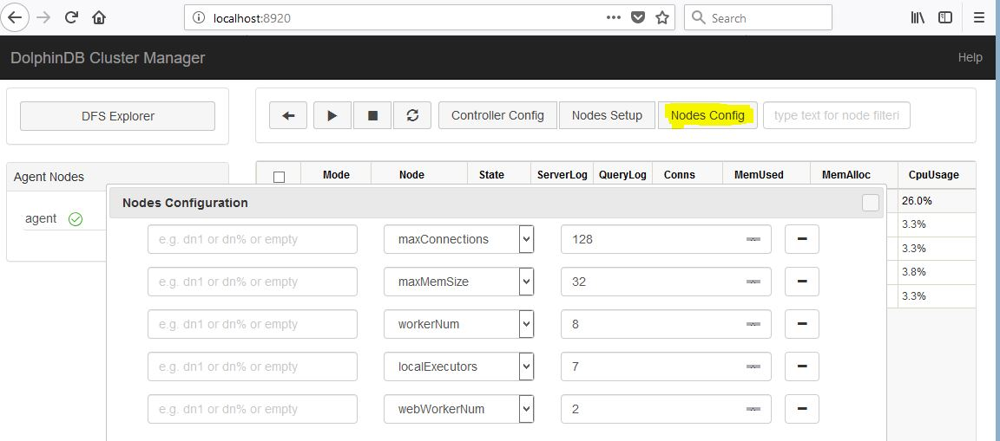

# DolphinDB 单物理节点集群部署

DolphinDB集群包括三种类型节点：数据节点（data node），代理节点（agent）和控制节点（controller）。
  *  数据节点用于数据存储，查询以及计算
  *  代理节点用于关闭或开启data node
  *  控制节点用于集群管理

#### 1. 下载
从DolphindB网站下载DolphinDB，并解压到一个指定目录。例如解压到如下目录：

```
/DolphinDB
```

#### 2. 软件授权许可更新

如果用户拿到了企业版试用授权许可，只需用其把替换如下授权许可文件即可。每个物理节点的授权许可文件都需要更新。与社区版本相比，企业版支持更多的节点，CPU内核和内存。

```
/DolphinDB/server/dolphindb.lic
```

#### 3. DolphinDB集群初始配置

启动一个集群，必须配置控制节点和代理节点。数据节点可以在集群启动后通过网络界面来配置，也可以在初始阶段配置。


#### 3.1.  配置控制节点

在配置集群的时候请核对授权文件规定的节点个数以及每个节点最多内核。如果配置超出授权文件规定，集群将无法正常启动。这些异常信息都会记录在log文件中。

进入server子目录。在server目录下，以Linux为例，创建config, data, log子目录。 这些子目录是为了方便用户理解本教程，但是不是必须的。

```
cd /DolphinDB/server/

mkdir /DolphinDB/server/config
mkdir /DolphinDB/server/data
mkdir /DolphinDB/server/log
```

#### 3.1.1 配置控制节点的参数文件
在config目录下，创建**controller.cfg**文件，可填写以下集群管理的常用参数。用户可根据实际需要调整参数。**controller.cfg**文件中只有**localSite**是必需的。其它参数都是可选参数。

```
localSite=localhost:8920:ctl8920
localExecutors=3
maxConnections=128
maxMemSize=16
webWorkerNum=4
workerNum=4
dfsReplicationFactor=1
dfsReplicaReliabilityLevel=0
```

以下是对这些参数的解释：


| 参数配置        | 解释          |
|:------------- |:-------------|
|localSite=localhost:8920:ctl8920 |节点局域网信息,格式为 IP地址:端口号:节点别名，所有字段都是必选项。|
|localExecutors=3  |                 本地执行者的数量。默认值是CPU的内核数量 - 1。|
|maxConnections=128         |        最大向内连接数。|
|maxMemSize=16    |                 最大内存（GB）。|
|webWorkerNum=4  |                   处理http请求的工作池的大小。默认值是1。|
|workerNum=4          |              常规交互式作业的工作池大小。默认值是CPU的内核数量。|
|dfsReplicationFactor=1     |        每个表分区或文件块的副本数量。默认值是2。|
|dfsReplicaReliabilityLevel=0 |      多个副本是否可以保存在同一台物理服务器上。 0：是; 1：不。默认值是0。|


#### 3.1.2 配置集群成员参数文件

在config目录下，创建**cluster.nodes**文件，可填写如下内容。用户可根据实际需要调整参数。**cluster.nodes**用于存放集群代理节点和数据节点信息。本教程使用4个数据节点，用户可更改节点个数。该配置文件分为两列，第一例存放节点IP地址，端口号，和节点别名。这三个信息由冒号：分隔。第二列是说明节点类型。比如代理节点类型为agent, 而数据节点类型为datanode。节点别名是大小写敏感的，而且在集群内必须是唯一的。

```
localSite,mode
localhost:8910:agent,agent
localhost:8921:DFS_NODE1,datanode
localhost:8922:DFS_NODE2,datanode
localhost:8923:DFS_NODE3,datanode
localhost:8924:DFS_NODE4,datanode
```
#### 3.1.3 配置数据节点参数文件
在config目录下，创建**cluster.cfg**文件，可填写如下内容。用户可根据实际需要调整参数。**cluster.cfg**的配置适用于集群中所有数据节点。

```
maxConnections=128
maxMemSize=32
workerNum=8
localExecutors=7
webWorkerNum=2
```

#### 3.2 配置代理节点参数文件

在config目录下，创建**agent.cfg**文件，可填写如下常用参数。用户可根据实际需要调整参数。只有**LocalSite**和**controllerSite**是必需参数。其它参数均为可选参数。

```
workerNum=3
localExecutors=2
maxMemSize=4
localSite=localhost:8910:agent
controllerSite=localhost:8920:ctl8920
```
在**controller.cfg**中的参数**localSite**应当与所有代理节点的配置文件**agent.cfg**中的参数**controllerSite**一致, 因为代理节点使用**agent.cfg**中的参数**controllerSite**来寻找controller。若**controller.cfg**中的参数**localSite**有变化，即使只是node alias有改变，所有代理节点的配置文件**agent.cfg**中的参数**controllerSite**都应当做相应的改变。

#### 3.3. DolphinDB集群启动

#### 3.3.1 启动代理节点

在可执行文件所在目录(server目录)运行以下命令行。注意到agent.log存放在log子目录下，如果出现agent无法正常启动的情况，可以根据此log file来诊断错误原因。


#### Linux后台模式启动
```
nohup ./dolphindb -console 0 -mode agent -home data -config config/agent.cfg -logFile log/agent.log &

```
建议通过Linux命令**nohup**（头） 和 **&**（尾）启动为后台运行模式，这样即使终端失去连接，DolphinDB也会持续运行。 

“-console”默认是为 1，如果要设置为后台运行，必须要设置为0（"-console 0")，否则系统运行一段时间后会自动退出。。

“-mode”表示节点性质，“-home”指定数据以及元数据存储路径，“-config”指定配置文件路径，“-logFile”指定log文件路径。


#### Linux前端交互模式启动

```
./dolphindb -mode agent -home data -config config/agent.cfg -logFile log/agent.log
```

#### Windows
```
dolphindb.exe -mode agent -home data -config config/agent.cfg -logFile log/agent.log
```

#### 3.3.2 启动控制节点

在可执行文件所在目录(server目录)运行以下命令行。注意到controller.log存放在log子目录下，如果出现agent无法正常启动的情况，可以根据此log file来诊断错误原因。

#### Linux

#### 启动为后台模式
```
nohup ./dolphindb -console 0 -mode controller -home data -config config/controller.cfg -clusterConfig config/cluster.cfg -logFile log/controller.log -nodesFile config/cluster.nodes &
```

#### 启动为前端交互模式
```
./dolphindb -mode controller -home data -config config/controller.cfg -clusterConfig config/cluster.cfg -logFile log/controller.log -nodesFile config/cluster.nodes
```

#### Windows
```
dolphindb.exe -mode controller -home data -config config/controller.cfg -clusterConfig config/cluster.cfg -logFile log/controller.log -nodesFile config/cluster.nodes
```

#### 3.3.3 如何关闭代理节点和控制节点

如果是启动为前端交互模式，可以在控制台中输入"quit"退出

```
quit
```

如果是启动为后台交互模式，需要用linux系统kill命令。假设运行命令的linux系统用户名为 "ec2-user"
```
ps aux | grep dolphindb  | grep -v grep | grep ec2-user|  awk '{print $2}' | xargs kill -TERM
```

#### 3.3.4 启动网络上的集群管理器

启动控制节点和代理节点之后，可以通过DolphinDB提供的集群管理界面来开启或关闭数据节点。在浏览器的地址栏中输入(目前支持浏览器为chrome, firefox)：

```
 localhost:8920 
```
(8920为控制节点的端口号)


#### 3.3.5 DolphinDB权限控制

DolphinDB提供了良好的安全机制。只有系统管理员才有权限做集群部署。在初次使用DolphinDB网络集群管理器时，需要用以下默认的系统管理员账号登录。

```
系统管理员帐号名: admin
默认密码       : 123456
```

点击登录链接


输入管理员用户名和密码


使用上述账号登录以后，可修改"admin"的密码，亦可添加用户或其他管理员账户。

#### 3.3.6 启动数据节点

选择所有数据节点，点击执行图标，并确定。节点启动可能要耗时30秒到一分钟。点击刷新图标来查看状态。若看到State栏全部为绿色对勾，则整个集群已经成功启动。


如果出现长时间无法正常启动，请查看log目录下该即诶但的logFile. 如果节点名字是DFS_NODE1，那对应的logFile应该在 log/DFS_NODE1.log。

log文件中有可能出现错误信息"Failed to bind the socket on XXXX"。这里的XXXX是待启动的节点端口号。这可能是因为此端口号被其它程序占用，这种情况下将其他程序关闭再重新启动节点即可。也可能是因为刚刚关闭了使用此端口的数据节点，Linux kernel还没有释放此端口号。这种情况下稍等30秒，再启动节点即可。

也可在控制节点执行以下代码来启动数据节点：
```
startDataNode(["DFS_NODE1", "DFS_NODE2","DFS_NODE3","DFS_NODE4"])
```

#### 4. 基于Web的集群管理

经过上述步骤，我们已经成功部署DolphinDB集群。在实际使用中我们经常会需要改变集群配置。DolphinDB的网络界面提供更改DolphinDB集群配置的所有功能。

#### 4.1. 控制节点参数配置

点击"Controller Config"按钮会弹出一个控制界面，这里的localExectors, maxConnections, maxMemSize, webWorkerNum以及workerNum等参数是我们在3.1.1中创建controller.cfg时填写的。这些配置信息都可以在这个界面上更改，新的配置会在重启控制节点之后生效。注意如果改变控制节点的localSite参数值，一定要在所有agent.cfg中对controllerSite参数值应做相应修改，否则会造成集群无法正常运行。


#### 4.2. 增删数据节点

点击"Nodes Setup"按钮，会进入集群节点配置界面。下图显示的配置信息是我们在3.1.2中创建的cluster.nodes中的信息。在此界面中可以添加或删除数据节点。新的配置会在整个集群重启之后生效。集群重启的具体步骤为：（1）关闭所有数据节点，（2）关闭控制节点，（3）启动控制节点，（4）启动数据节点。另外需要注意，如果节点上已经存放数据，删除节点有可能会造成数据丢失。


若新的数据节点位于一个新的物理机器上，我们必须在此物理机器上根据3.2中的步骤配置并启动一个新的代理节点，在**cluster.nodes**中增添有关新的代理节点和数据节点的信息，并重新启动控制节点。

#### 4.3. 修改数据节点参数

点击"Nodes Config"按钮, 可进行数据节点配置。以下参数是我们在3.1.3中创建cluster.cfg中提供的。除了这些参数之外，用户还可以根据实际应用在这里添加配置其它参数。重启所有数据节点后即可生效。




#### 5. DolphinDB 集群详细配置以及参数意义

中文

http://dolphindb.com/cn/help/Newtopic47.html

英文

http://dolphindb.com/help/ClusterSetup.html
