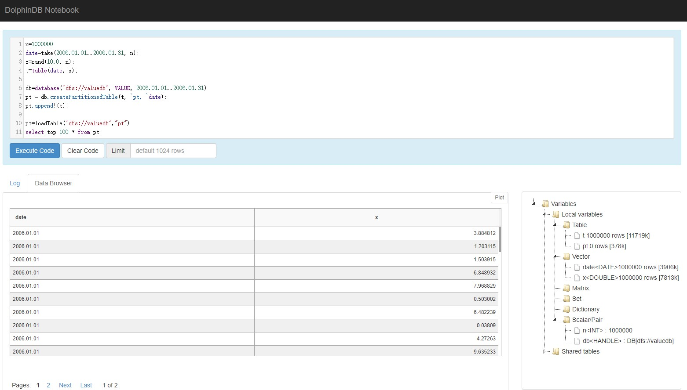

# DolphinDB 单节点部署

在单节点运行DolphinDB，可以帮助用户快速上手DolphinDB。用户只需下载DolphinDB程序包，下载地址：[http://www.dolphindb.cn/downloads.html](http://www.dolphindb.cn/downloads.html)

解压缩程序包，例如解压到如下目录：

```sh
/DolphinDB
```

## 1. 软件授权许可更新

如果用户拿到企业版试用授权许可，只需用其替换如下文件即可。

```sh
/DolphinDB/server/dolphindb.lic
```

如果用户没有申请企业版试用授权许可，可以直接使用程序包中的社区版试用授权许可。社区试用版指定了DolphinDB最大可用内存为4GB。

## 2. 运行DolphinDB Server

进入server目录 /DolphinDB/server/，

- Linux系统

在Linux环境中运行DolphinDB可执行文件前，需要修改文件权限：

```sh
chmod 777 dolphindb
```

执行以下指令：

```sh
./dolphindb
```

如果要在Linux后台运行DolphinDB，可执行以下指令:

```sh
nohup ./dolphindb -console 0 &
```

建议通过Linux命令nohup（头）和 &（尾）启动为后台运行模式，这样即使终端失去连接，DolphinDB也会持续运行。

`-console`默认是为 1，如果要设置为后台运行，必须要设置为0（`-console 0`)，否则系统运行一段时间后会自动退出。

如果用户在Linux前台运行DolphinDB，那么用户可以通过命令行来执行DolphinDB代码；如果在Linux后台运行DolphinDB，那么用户不能通过命令行来执行DolphinDB代码，可以通过[GUI](http://www.dolphindb.cn/cn/gui/GUIGetStarted.html)、[DolphinDB Notebook](http://www.dolphindb.cn/cn/gui/NotebookGetStarted.html)或[VS code](https://github.com/dolphindb/Tutorials_CN)等图形用户界面来执行代码。

- Windows系统

在Windows环境中只需双击运行dolphindb.exe。

系统默认端口号是8848。如果需要指定其它端口可以通过如下命令行：

- Linux系统:

```sh
./dolphindb -localSite localhost:8900:local8900
```

- Windows系统:

```sh
dolphindb.exe -localSite localhost:8900:local8900
```

软件授权书dolphindb.lic指定DolphinDB可用的最大内存，用户也可以根据实际情况来调整该值。最大内存限制由配置参数maxMemSize（单位是GB）指定，我们可以在启动DolphinDB时指定该参数：

- Linux:

```sh
./dolphindb -localSite localhost:8900:local8900 -maxMemSize 32
```

- Windows:

```sh
dolphindb.exe -localSite localhost:8900:local8900 -maxMemSize 32
```

## 3. 网络连接到DolphinDB Server

到浏览器中输入localhost:8848(或其它端口号)。目前支持Chrome与Firefox浏览器。

## 4. 通过网络界面运行DolphinDB脚本

在DolphinDB notebook的编辑器窗口输入以下DolphinDB代码：

```txt
n=1000000
date=take(2006.01.01..2006.01.31, n);
x=rand(10.0, n);
t=table(date, x);

login("admin","123456")
db=database("dfs://valuedb", VALUE, 2006.01.01..2006.01.31)
pt = db.createPartitionedTable(t, `pt, `date);
pt.append!(t);

pt=loadTable("dfs://valuedb","pt")
select top 100 * from pt
```

下图展示了运行结果



DolphinDB面对的是海量数据的场景，因此数据库表是需要分区的。关于分区请参考[DolphinDB分区教程](https://github.com/dolphindb/Tutorials_CN/blob/master/database.md)。

和传统的数据库不同，DolphinDB是集数据库、编程语言和分布式计算于一体的系统。数据库和表在DolphinDB并不存在独立的保留空间，每次访问数据库表时都需要通过`loadTable`函数将数据库表赋值到一个变量中。变量的名称可以和数据库表的名称不同。例如

```
tmp=loadTable("dfs://valuedb","pt")
select top 100 * from tmp
```

默认情况下，数据文件保存在DolphinDB部署包/server/local8848目录下，可在dolphindb.cfg中设置volumes配置参数来修改保存数据文件的目录。

> 注意：
> 1. 从V0.98版本开始，DolphinDB单实例支持分布式数据库。
> 2. 使用DolphinDB Notebook时，若10分钟内无命令执行，系统会自动关闭会话以释放DolphinDB系统资源。建议用户在DolphinDB GUI中编写代码与执行命令。DolphinDB GUI中的会话在用户关闭之前会一直存在。

## 5. 修改配置

修改单节点的配置参数有以下两种方式：

- 修改配置文件`dolphindb.cfg`。
- 在命令行中启动节点时指定配置参数。例如，启动节点时指定端口号为8900，最大内存为4GB：

Linux:

```sh
./dolphindb -localSite localhost:8900:local8900 -maxMemSize 4
```

Windows:

```sh
dolphindb.exe -localSite localhost:8900:local8900 -maxMemSize 4
```

更多DolphinDB配置参数请查看[集群配置](https://www.dolphindb.cn/cn/help/ClusterSetup.html)。

## 6. 更多详细信息，请参阅DolphinDB帮助文档

- [中文](https://www.dolphindb.cn/cn/help/index.html)
- [英文](http://dolphindb.com/help/)